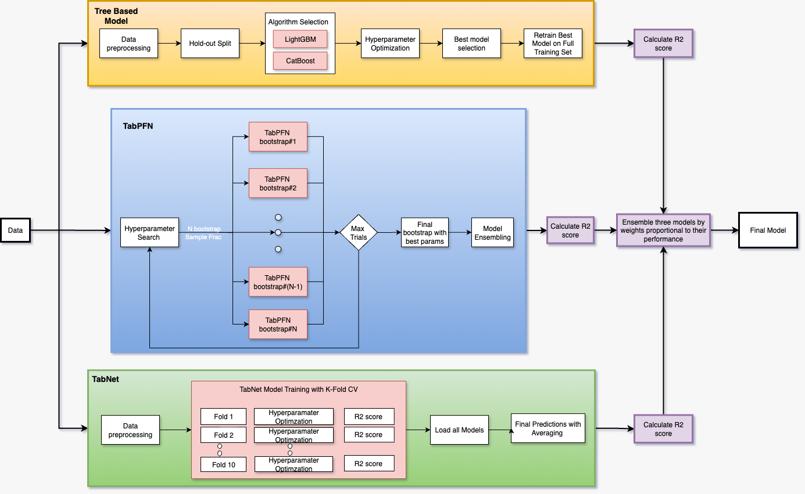
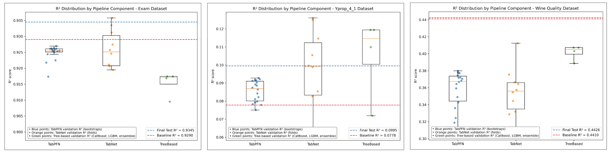

This project is a ensemble based one-click AutoML Pipeline that does regression on any dataset with tabular data. 
The way this pipeline works is best represented via the diagram below:

Results were really good and can be seen with the boxplots below:

You can also view the full research poster here : [Research Poster](poster.pdf)

For instruction on how to run the pipeline check the run_instructions.md, also on src/utils you have a python script that downloads some popular tabular datasets which can be used for testing.